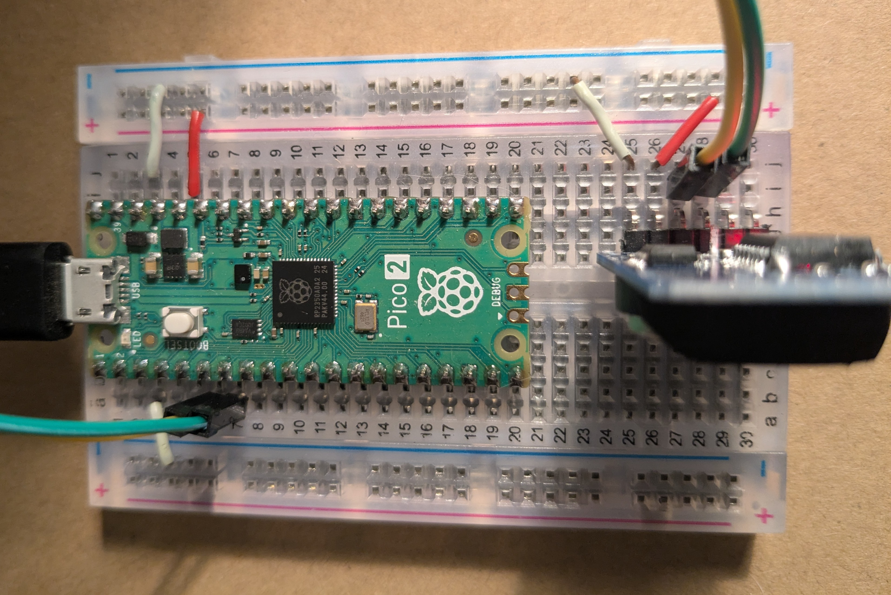

# Telemetry Acquisition System Testing Module

This project simulates telemetry data for a small rocket, providing realistic data for testing TAS-GUI. It includes two modes: **standby mode**, simulating the rocket on a landing pad, and **launch mode**, simulating a rocket launch and ascent. The simulation can be customized with different scenarios.

## Features

- **Real-time telemetry data:** Outputs data such as acceleration, altitude, pressure, temperature, and speed.
- **Standby Mode:** Simulates the rocket on a landing pad.
- **Launch Mode:** Simulates a 20 kg rocket during launch, including environmental effects.
- **Button-controlled state switching:** A physical button toggles between standby and launch modes.
- **Scenario-based simulation:** Customize the simulation environment with predefined scenarios like "sunny_texas" and "cold_maine".

## Hardware Requirements



- A microcontroller with USB CDC support.
- A breadboard with a button connected to a GPIO pin.
- CircuitPython-compatible microcontroller.

## Software Requirements

- CircuitPython installed on the microcontroller.
- Libraries: `usb_cdc`, `digitalio`, `board`, `neopixel`.

## Wiring Instructions

1. Connect a button to the microcontroller GPIO pin `D5` (or adjust in the code).

## Installation

1. Copy the `code.py` and `boot.py` files onto the microcontroller.
2. Ensure the required CircuitPython libraries are present on the device.
3. Connect the device to your computer via USB.

## Usage

1. Connect the microcontroller to a USB port.
2. Open a serial terminal to observe telemetry data.
3. Press the button to toggle between **standby** and **launch** modes.
4. Modify the `simulation_scenario` variable in `code.py` to switch between different scenarios (e.g., "sunny_texas" or "cold_maine").

## Telemetry Data Table


| Value in Data String | Mapped Variable   | Description                                   |
|----------------------|-------------------|-----------------------------------------------|
| `0.08`               | `accel_x`         | IMU X-axis acceleration (m/s²)                |
| `-0.40`              | `accel_y`         | IMU Y-axis acceleration (m/s²)                |
| `-9.74`              | `accel_z`         | IMU Z-axis acceleration (m/s²)                |
| `14.00`              | `gyro_x`          | IMU X-axis angular velocity (°/s)             |
| `16.00`              | `gyro_y`          | IMU Y-axis angular velocity (°/s)             |
| `-96.00`             | `gyro_z`          | IMU Z-axis angular velocity (°/s)             |
| `31.25`              | `imu_temp`        | IMU internal temperature (°C)                 |
| `33.56`              | `bme_temp`        | BME280 temperature reading (°C)               |
| `1009.91`            | `bme_pressure`    | BME280 atmospheric pressure (hPa)             |
| `-31.06`             | `bme_altitude`    | BME280 altitude (m)                           |
| `35.39`              | `bme_humidity`    | BME280 humidity (%)                           |
| `1`                  | `gps_fix`         | GPS fix status (1 = fixed, 0 = not fixed)      |
| `2`                  | `gps_fix_quality` | GPS fix quality (e.g., 1 = GPS fix, 2 = DGPS) |
| `26.273800`          | `gps_lat`         | GPS latitude (decimal degrees)                 |
| `-98.431976`         | `gps_lon`         | GPS longitude (decimal degrees)                |
| `0.16`               | `gps_speed`       | GPS ground speed (m/s)                        |
| `68.00`              | `gps_altitude`    | GPS altitude (m)                              |
| `8`                  | `gps_satellites`  | Number of GPS satellites in use               |


## Telemetry Data Format

Data is output in the following format:

```
[timestamp] accel_x, accel_y, accel_z, gyro_x, gyro_y, gyro_z, imu_temp, bme_temp, bme_pressure, bme_altitude, bme_humidity, gps_fix, gps_fix_quality, gps_lat, gps_lon, gps_speed, gps_altitude, gps_satellites
```

### Example Output

**Standby Mode:**
```
$Message length: 115
Message: [2024/12/19 (Thursday) 13:06:42] 0.0,0.0,0.0,0.0,0.0,0.0,30.57,35.0,1013.25,0.0,20.0,1,2,32.9394,-106.922,0.0,0.0,8
RSSI: -97
Snr: 7.39
```

**Launch Mode:**
```
$Message length: 130
Message: [2024/12/19 (Thursday) 13:00:02] 15.1,-0.02,-0.4,82.33,-65.0,72.93,31.17,7.52,616.2,4003.17,0,1,2,32.9394,-106.922,82.16,4227.45,8
RSSI: -97
Snr: 7.87
```

## Code Overview

### Main Components

1. **`RocketSimulation` Class:**
   - Handles rocket state, including speed, altitude, and environmental factors.
   - Includes methods for standby and launch simulations.
   - Supports scenario-based simulation with predefined conditions.

2. **`update_speed`, `update_altitude`, `update_environmental_factors` Functions:**
   - Calculates speed, altitude, and environmental parameters dynamically based on the rocket's state.

3. **Button Integration:**
   - Toggles the rocket's state between standby and launch using a button input.

4. **NeoPixel Integration:**
   - Indicates the current state with different colors (green for standby, red for launch).

## Customization

- Adjust rocket parameters (e.g., mass, thrust) by modifying the `RocketSimulation` class.
- Change the button GPIO pin in the `button = digitalio.DigitalInOut(board.D5)` line.
- Modify the `simulation_scenario` variable to switch between different scenarios (e.g., "sunny_texas" or "cold_maine").


